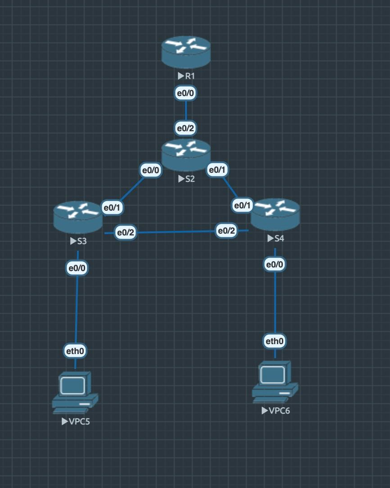

Сделано согласно требованиям дз.
Линк между свитчами доступа заблокирован по протоколу stp, так как свитч уровня распределения является корнем. Отключил vtp на всех свитчах.
Лабораторка - `lab1.unl`, конфиги свитчей и роутера хранятся в configs


Клиент 1(VPC5)
```
VPCS> show ip

NAME        : VPCS[1]
IP/MASK     : 10.0.10.2/24
GATEWAY     : 10.0.10.1
DNS         : 
MAC         : 00:50:79:66:68:05
LPORT       : 20000
RHOST:PORT  : 127.0.0.1:30000
MTU         : 1500

VPCS> ping 10.0.20.2           

84 bytes from 10.0.20.2 icmp_seq=1 ttl=63 time=251.287 ms
84 bytes from 10.0.20.2 icmp_seq=2 ttl=63 time=58.412 ms
84 bytes from 10.0.20.2 icmp_seq=3 ttl=63 time=91.381 ms
84 bytes from 10.0.20.2 icmp_seq=4 ttl=63 time=121.419 ms
84 bytes from 10.0.20.2 icmp_seq=5 ttl=63 time=62.326 ms
```

Клиент 2(VPC6)
```
VPCS> show ip

NAME        : VPCS[1]
IP/MASK     : 10.0.20.2/24
GATEWAY     : 10.0.20.1
DNS         : 
MAC         : 00:50:79:66:68:06
LPORT       : 20000
RHOST:PORT  : 127.0.0.1:30000
MTU         : 1500

VPCS> ping 10.0.10.2

84 bytes from 10.0.10.2 icmp_seq=1 ttl=63 time=543.280 ms
84 bytes from 10.0.10.2 icmp_seq=2 ttl=63 time=365.743 ms
84 bytes from 10.0.10.2 icmp_seq=3 ttl=63 time=240.539 ms
84 bytes from 10.0.10.2 icmp_seq=4 ttl=63 time=229.463 ms
84 bytes from 10.0.10.2 icmp_seq=5 ttl=63 time=93.966 ms
```

Switch 1(S3)
```
Switch#show vlan

VLAN Name                             Status    Ports
---- -------------------------------- --------- -------------------------------
1    default                          active    Et0/3
10   VLAN0010                         active    Et0/0, Et0/1, Et0/2
1002 fddi-default                     act/unsup 
1003 token-ring-default               act/unsup 
1004 fddinet-default                  act/unsup 
1005 trnet-default                    act/unsup 

VLAN Type  SAID       MTU   Parent RingNo BridgeNo Stp  BrdgMode Trans1 Trans2
---- ----- ---------- ----- ------ ------ -------- ---- -------- ------ ------
1    enet  100001     1500  -      -      -        -    -        0      0   
10   enet  100010     1500  -      -      -        -    -        0      0   
1002 fddi  101002     1500  -      -      -        -    -        0      0   
1003 tr    101003     1500  -      -      -        -    -        0      0   
1004 fdnet 101004     1500  -      -      -        ieee -        0      0   
1005 trnet 101005     1500  -      -      -        ibm  -        0      0   

Primary Secondary Type              Ports
------- --------- ----------------- ------------------------------------------
```

Switch 2(S4)
```
Switch#show vlan

VLAN Name                             Status    Ports
---- -------------------------------- --------- -------------------------------
1    default                          active    Et0/3
20   VLAN0020                         active    Et0/0, Et0/1, Et0/2
1002 fddi-default                     act/unsup 
1003 token-ring-default               act/unsup 
1004 fddinet-default                  act/unsup 
1005 trnet-default                    act/unsup 

VLAN Type  SAID       MTU   Parent RingNo BridgeNo Stp  BrdgMode Trans1 Trans2
---- ----- ---------- ----- ------ ------ -------- ---- -------- ------ ------
1    enet  100001     1500  -      -      -        -    -        0      0   
20   enet  100020     1500  -      -      -        -    -        0      0   
1002 fddi  101002     1500  -      -      -        -    -        0      0   
1003 tr    101003     1500  -      -      -        -    -        0      0   
1004 fdnet 101004     1500  -      -      -        ieee -        0      0   
1005 trnet 101005     1500  -      -      -        ibm  -        0      0   

Primary Secondary Type              Ports
------- --------- ----------------- ------------------------------------------
```

Switch root(S2)
```
Switch#show spanning-tree

VLAN0001
  Spanning tree enabled protocol ieee
  Root ID    Priority    32769
             Address     aabb.cc00.2000
             This bridge is the root
             Hello Time   2 sec  Max Age 20 sec  Forward Delay 15 sec

  Bridge ID  Priority    32769  (priority 32768 sys-id-ext 1)
             Address     aabb.cc00.2000
             Hello Time   2 sec  Max Age 20 sec  Forward Delay 15 sec
             Aging Time  300 sec

Interface           Role Sts Cost      Prio.Nbr Type
------------------- ---- --- --------- -------- --------------------------------
Et0/3               Desg FWD 100       128.4    Shr 


          
VLAN0010
  Spanning tree enabled protocol ieee
  Root ID    Priority    32778
             Address     aabb.cc00.2000
             This bridge is the root
             Hello Time   2 sec  Max Age 20 sec  Forward Delay 15 sec

  Bridge ID  Priority    32778  (priority 32768 sys-id-ext 10)
             Address     aabb.cc00.2000
             Hello Time   2 sec  Max Age 20 sec  Forward Delay 15 sec
             Aging Time  300 sec

Interface           Role Sts Cost      Prio.Nbr Type
------------------- ---- --- --------- -------- --------------------------------
Et0/0               Desg FWD 100       128.1    Shr 
Et0/2               Desg FWD 100       128.3    Shr 


          
VLAN0020
  Spanning tree enabled protocol ieee
  Root ID    Priority    32778
             Address     aabb.cc00.2000
             Cost        300
             Port        2 (Ethernet0/1)
             Hello Time   2 sec  Max Age 20 sec  Forward Delay 15 sec

  Bridge ID  Priority    32788  (priority 32768 sys-id-ext 20)
             Address     aabb.cc00.2000
             Hello Time   2 sec  Max Age 20 sec  Forward Delay 15 sec
             Aging Time  300 sec

Interface           Role Sts Cost      Prio.Nbr Type
------------------- ---- --- --------- -------- --------------------------------
Et0/1               Root FWD 100       128.2    Shr 
Et0/2               Desg FWD 100       128.3    Shr 


```

Router(R1)
```
Router#show ip route
Codes: L - local, C - connected, S - static, R - RIP, M - mobile, B - BGP
       D - EIGRP, EX - EIGRP external, O - OSPF, IA - OSPF inter area 
       N1 - OSPF NSSA external type 1, N2 - OSPF NSSA external type 2
       E1 - OSPF external type 1, E2 - OSPF external type 2
       i - IS-IS, su - IS-IS summary, L1 - IS-IS level-1, L2 - IS-IS level-2
       ia - IS-IS inter area, * - candidate default, U - per-user static route
       o - ODR, P - periodic downloaded static route, H - NHRP, l - LISP
       a - application route
       + - replicated route, % - next hop override

Gateway of last resort is not set

      10.0.0.0/8 is variably subnetted, 4 subnets, 2 masks
C        10.0.10.0/24 is directly connected, Ethernet0/0.10
L        10.0.10.1/32 is directly connected, Ethernet0/0.10
C        10.0.20.0/24 is directly connected, Ethernet0/0.20
L        10.0.20.1/32 is directly connected, Ethernet0/0.20
```